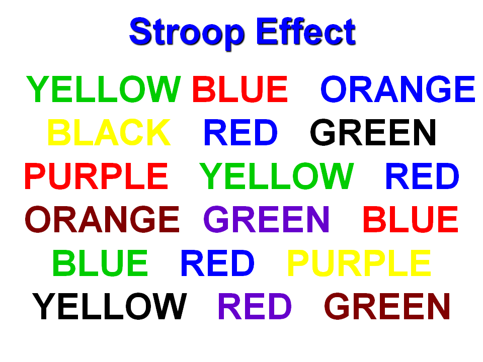

# Hypothesis testing of the Stroop effect

The [Stroop effect](https://en.wikipedia.org/wiki/Stroop_effect#Stroop_test) named after John Ridley Stroop, an American psychologist, is a demonstration of increased reaction time when test subjects are presented with incongruent words. An example of an incongruent word - word red colored in blue, and the test subject has to name the color of the word. In this project, I performed a hypothesis test of the Stroop effect based on a small sample data of the reaction times of congruent and incongruent words.

## Files

| File name | Description |
| :--- | :--- |
| [environment.yml](environment.yml) | Conda environment required to run this code |
| [stroop_data.csv](stroop_data.csv) | csv file with the stroop effect reaction time sample data |
| [The+Stroop+effect.ipynb](The+Stroop+effect.ipynb) | Jupyter Notebook with the code and analysis |

## Setup

- You must have [Anaconda](https://www.continuum.io/downloads) installed to run this code.
- Create a conda environment using [environment.yml](environment.yml) YAML file. More help on this can be found [here](https://conda.io/docs/using/envs.html#use-environment-from-file).

## License

The contents of this repository are covered under the [MIT License](LICENSE).
